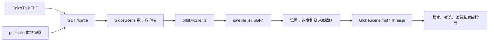

# ORBITAL/LIVE 项目总结

> 文档状态：当前实现总结
> 更新日期：2026-07-30
> 项目目录：`D:\1_Codex\7_satellite`

## 1. 项目定位

ORBITAL/LIVE 是一个在浏览器中运行的三维卫星轨道可视化应用。它从 CelesTrak 获取公开 TLE（Two-Line Element）轨道根数，使用 `satellite.js` 的 SGP4 模型推算卫星位置，再通过 Three.js 渲染地球、卫星、轨道和覆盖范围。

当前产品重点是：

- 在三维地球上浏览 Starlink、GPS 和空间站目标；
- 搜索卫星名称或 NORAD ID；
- 查看高度、速度、经纬度、轨道周期和 TLE 历元；
- 调整模拟时间和播放速度；
- 在上游不可用时自动使用本地 TLE 快照；
- 明确展示数据来源和数据时效；
- 保持卫星轨道半径的物理比例。

## 2. 数据真实性边界

项目使用的卫星名称、NORAD ID 和 TLE 来源于公开轨道目录，但页面展示的位置和遥测数据不是卫星直接下行的实时遥测。

| 数据 | 实际来源 |
|---|---|
| 卫星名称、NORAD ID、TLE | CelesTrak 在线数据或仓库内快照 |
| 经纬度、高度、速度 | 浏览器根据 TLE 使用 SGP4 推算 |
| 未来轨道 | 按当前 TLE 向未来传播计算 |
| 轨道周期 | 根据 TLE 平均运动计算 |
| 国家、运营方 | 按分组和名称关键词进行静态分类 |
| 夜间灯光 | NASA Black Marble 2016 历史合成影像 |

因此，准确描述应为：

> 使用公开 TLE，通过 SGP4 实时推算卫星轨道位置。

不应将项目描述为卫星实时下行遥测系统。轨道精度取决于 TLE 历元、目标轨道特性和传播时间跨度。

## 3. 当前功能

### 3.1 三维地球

- Three.js/WebGL 三维地球；
- 实时太阳方向和昼夜分界；
- NASA 夜间灯光纹理；
- 经纬网、国界和海岸线；
- 星空背景、大气层和地球边缘光；
- 拖动旋转、滚轮缩放；
- 浏览器不支持 WebGL 时显示明确错误状态。

### 3.2 卫星显示

- Starlink 圆形标记；
- GPS 菱形标记；
- 空间站方形标记；
- 按分组显示或隐藏；
- 地球背面的目标通过遮挡判断避免误选；
- GPS、Starlink 和空间站均采用真实轨道半径，不进行视觉高度压缩；
- 最大相机距离为 `15`，可以容纳完整 GPS 轨道球；
- 聚焦相机会根据目标轨道半径保持在卫星外侧。

### 3.3 搜索与跟踪

- 按名称或 NORAD ID 搜索；
- 支持键盘上下键选择和回车确认；
- 点击卫星或搜索结果进入跟踪；
- 显示选中卫星未来一个轨道周期；
- 显示高度、速度、经纬度、国家、运营方、发射年份和 TLE 历元；
- `Esc` 或面板关闭按钮取消跟踪并恢复原相机位置。

### 3.4 时间模拟

- 暂停和继续；
- 返回当前时间；
- 时间轴拖动；
- 前后跳转一小时；
- `1×`、`10×`、`60×` 模拟速度；
- 快捷键 `Space`、`R`、`1`、`2`、`3`。

### 3.5 界面控制

- 地球自动旋转开关；
- 左侧控制面板显隐；
- 右侧跟踪面板显隐；
- 设置保存在浏览器 `localStorage`；
- 支持 `prefers-reduced-motion`；
- 桌面端和移动端响应式布局。

## 4. 技术架构



### 4.1 技术栈

| 层级 | 技术 |
|---|---|
| UI | React 19、Next.js 16 App Router |
| 构建 | vinext、Vite 8 |
| 三维渲染 | Three.js |
| 轨道传播 | satellite.js / SGP4 |
| 并行计算 | Web Worker |
| 地图 | world-atlas、Natural Earth、topojson-client |
| 样式 | Tailwind CSS 4、自定义 CSS |
| 部署 | OpenAI Sites 配置、Cloudflare Workers |
| 预留能力 | Drizzle ORM、Cloudflare D1 |

### 4.2 关键模块

| 文件 | 职责 |
|---|---|
| `app/page.tsx` | 主页面状态、搜索、筛选、时间轴和面板 |
| `app/components/GlobeScene.tsx` | 禁用 SSR 的客户端场景包装 |
| `app/components/GlobeSceneImpl.tsx` | Three.js 场景、相机、卫星点层和交互 |
| `app/workers/orbit.worker.ts` | TLE 解析、SGP4 传播和遥测计算 |
| `app/api/tle/route.ts` | CelesTrak 代理、校验、缓存和快照降级 |
| `app/config/orbit-groups.json` | 分组、颜色、图标和数据校验阈值 |
| `app/lib/orbit-groups.ts` | 类型化分组配置 |
| `app/lib/orbit-types.ts` | 场景和页面共享类型 |
| `app/lib/orbit-camera.mjs` | 全景和聚焦相机距离策略 |
| `app/lib/tle-data.mjs` | TLE 元数据解析和严格校验 |
| `scripts/update-tle.mjs` | 本地 TLE 检查和更新入口 |
| `scripts/lib/tle-updater.mjs` | 顺序下载、验证和原子写入 |

## 5. TLE 数据机制

### 5.1 在线请求

公共接口：

```http
GET /api/tle?group=<starlink|gps-ops|stations>
```

手动强制刷新：

```http
GET /api/tle?group=stations&refresh=<timestamp>
```

主要响应头：

| 响应头 | 含义 |
|---|---|
| `x-orbital-source` | `celestrak-live` 或 `bundled-snapshot` |
| `x-orbital-served-at` | 本次服务时间 |
| `x-orbital-tle-epoch-min` | 返回数据中最早 TLE 历元 |
| `x-orbital-tle-epoch-max` | 返回数据中最新 TLE 历元 |
| `x-orbital-record-count` | 有效记录数 |

上游请求超时为 8 秒。CelesTrak 请求失败、返回错误状态、HTML、过旧数据或无效 TLE 时，API 返回打包快照。

### 5.2 严格校验

更新器和在线上游数据会校验：

- 三行 TLE 结构；
- 第 1、2 行格式；
- NORAD ID 是否一致；
- 是否存在重复 NORAD ID；
- TLE 行校验和；
- 最低记录数；
- 最新历元是否过旧或异常超前。

只有全部分组下载和校验成功后，更新器才写入文件，避免部分更新。

### 5.3 当前本地快照

2026-07-30 检查结果：

| 分组 | 记录数 | 最新历元 |
|---|---:|---|
| Starlink | 10,771 | 2026-07-29 01:25:30 UTC |
| GPS | 32 | 2026-07-28 22:39:21 UTC |
| 空间站 | 22 | 2026-07-28 22:35:12 UTC |

生成本文档时，快照年龄约为 39–42 小时。

## 6. 自动更新

GitHub Actions 工作流位于：

```text
.github/workflows/update-tle.yml
```

执行策略：

1. 每天 UTC 02:17 自动运行，也支持手动触发；
2. 安装锁定依赖；
3. 顺序请求 CelesTrak，降低并发请求触发限流的概率；
4. 校验全部分组；
5. 运行完整质量门禁；
6. 有变化时创建或更新 `automation/tle-snapshots` 分支；
7. 创建更新 PR；
8. 不直接提交到 `main`，不自动部署生产环境。

GitHub 仓库需要允许 GitHub Actions 使用 `GITHUB_TOKEN` 创建 Pull Request，否则最后一步会因仓库权限设置失败。

## 7. 本地开发和验证

环境要求：

- Node.js `>=22.13.0`；
- npm。

常用命令：

```bash
# 安装依赖
npm install

# 开发服务器
npm run dev

# Lint
npm run lint

# 类型检查
npm run typecheck

# 生产构建和全部测试
npm test

# 完整门禁
npm run verify

# 检查本地 TLE
npm run tle:check

# 下载并更新 TLE
npm run tle:update

# Cloudflare 运行时本地预览
npm run preview:cloudflare
```

最近一次完整验证结果：

- ESLint：通过；
- TypeScript：通过；
- vinext 生产构建：通过；
- Node 测试：`13/13` 通过；
- npm 高危依赖审计：未报告漏洞；
- 构建仍提示 Three.js 场景存在超过 500 KB 的客户端 chunk。

## 8. 部署

### 8.1 当前配置

- OpenAI Sites Project ID：`appgprj_6a5b044b09848191a01efa48a29663d0`
- Worker 名称：`orbital-live`
- README 记录的生产地址：`https://orbital-live.1hillindigo.workers.dev`
- 当前功能不依赖 D1 或 R2

本文档生成时未重新验证生产地址是否已经包含当前本地改动。

### 8.2 Cloudflare 部署命令

```bash
npx wrangler whoami
npm run verify
npm run deploy:cloudflare:dry-run
npm run deploy:cloudflare
```

`vinext build` 生成：

```text
dist/server/index.js
dist/server/wrangler.json
dist/client/
```

该项目包含动态 `/api/tle` 接口，不能只把 `dist/client` 当作普通静态站上传到 GitHub Pages。

## 9. 当前 Git 状态

生成本文档时：

- 当前分支：`main`
- 当前 HEAD：`2e1d71a fix: show snapshot refresh time`
- 本地 HEAD 与 `github/main` 的已提交位置一致；
- GPS 真实比例、相机、TLE 自动更新、最新快照、文档和测试等改动仍在工作区；
- 这些改动尚未提交或推送 GitHub；
- 本地改动也尚未重新部署到生产站点。

提交前应再次检查完整差异，避免包含本地日志、PID、临时文件或凭据。

## 10. 已知限制

1. 目前只加载 Starlink、GPS 和空间站，不是全球全部在轨物体目录。
2. TLE 推算不是实时遥测，长时间传播误差会增大。
3. 国家和运营方是静态规则推断，不是权威元数据。
4. 没有协方差和 CDM 数据，不能提供可信碰撞风险预警。
5. Three.js 场景包较大，低端移动设备性能仍需专项测量。
6. `GlobeSceneImpl.tsx` 仍然承担较多场景生命周期职责，可以继续拆分。
7. 仓库仍保留未启用的 ChatGPT Auth、Drizzle/D1 模板代码。
8. 当前仓库没有 `LICENSE` 文件，不应在添加许可证前称为开源项目。
9. 本地 TLE 自动更新可能受到 CelesTrak 限流，工作流失败时应保留旧快照并重试。

## 11. 后续建议

优先级建议：

1. **地面观察点和过境预测**：计算 AOS、最高仰角、LOS、方位角和倒计时；
2. **日照和地影状态**：判断卫星是否受太阳照射，以及观察地点是否处于夜间；
3. **星下点轨迹**：展示过去和未来的地面投影轨迹；
4. **性能专项优化**：测量移动端帧率、Worker 延迟、首屏资源和 Three.js chunk；
5. **进一步拆分场景模块**：将地球材质、卫星点层、相机和数据客户端独立；
6. **补充 CI 与发布检查**：为普通 PR 增加质量门禁，并记录生产回滚方式。

“可分享场景链接”不在当前开发计划内。

## 12. 总结

ORBITAL/LIVE 已经形成完整的公开轨道数据可视化链路，不再只是静态 Three.js 展示。当前版本具备在线 TLE、快照降级、数据健康状态、Web Worker 轨道传播、真实轨道比例、搜索跟踪和自动数据维护能力。

下一阶段应优先增加面向真实使用场景的观察点和过境预测，同时继续降低场景模块耦合并优化移动端性能。
